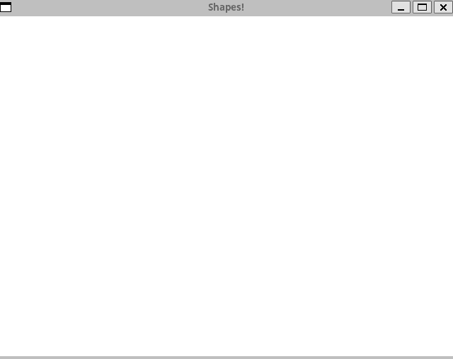

## Basic shapes using Simple DirectMedia Layer 2.0



### Installing SDL2

This project uses latest build of SDL2[^1]. Here is how you can obtain it[^2]
```bash
git clone https://github.com/libsdl-org/SDL.git -b SDL2
cd SDL
mkdir build
cd build
../configure
make
sudo make install
```

By default this sequence installs SDL2 into `/usr/local`, this is why this path
is used for locating include and library files.

### Building project

This project builds at std=c++17 with [FASTBuild](https://fastbuild.org/docs/home.html)

```bash
fbuild
```

### Running project

All executable files are located in `out` folder

```bash
./out/sdl2_shapes
```

**Description**

After start of the application you are presented with white canvas.
You can fill this canvas with basic shapes by pressing one of the next keys
* <button>S</button> creates sphere
* <button>T</button> creates triangle
* <button>R</button> creates rectangle

[^1]: prebuilt binaries for Ubuntu 20.04.6 LTS have outdated version  
[^2]: according to [official documentation](https://wiki.libsdl.org/SDL2/Installation)
